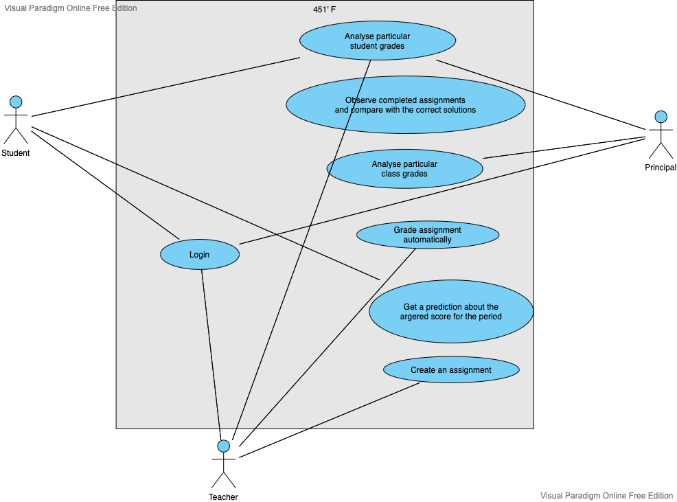

## User roles

### Student

The Student can login to their account, analyse particular grades and get prediction about the aggregated score.

### Principal

The Principal can login to their account, analyse particular grades and analyse particular class grades.

### Teacher

The Teacher can login to their account, create assignments, analyse particular grades and grade assignments automatically.

## Use Case Diagram

  

## User stories

* As an schoolteacher, I want to be able to create tests with automatic checking, so I can reduce time spent on manual evaluation of tests

* As an pupil, I want objective grades, so I will accurately assess my knowledge

* As an school principal, I want to know information about the dynamics of learning in different classes, so I can assess the quality of my employess' work

## Job stories

* When the end of the module comes, I want to objectively assess the student's progress, so I can honestly give the student a grade

* When the students wrote the test, I want to automatically give them grades, so I can spend more time preparing for the new classwork

* When a student's parents complain about unfair grading, I want to show them the student's work and the results of the automatic test checking, so I can avoid conflict